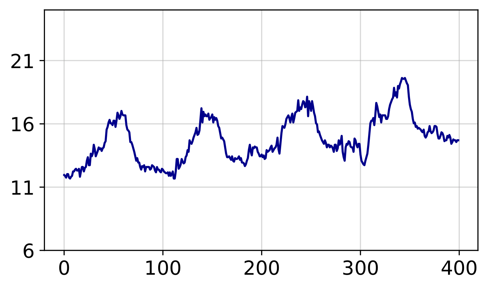
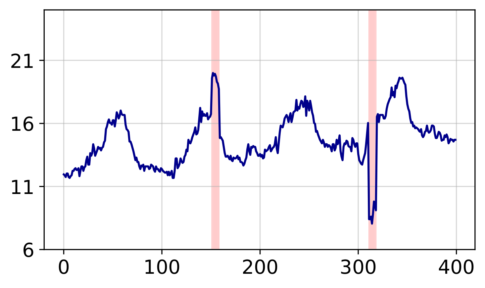
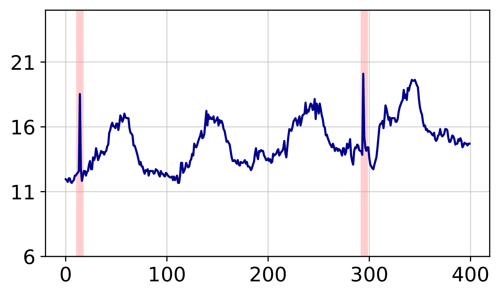
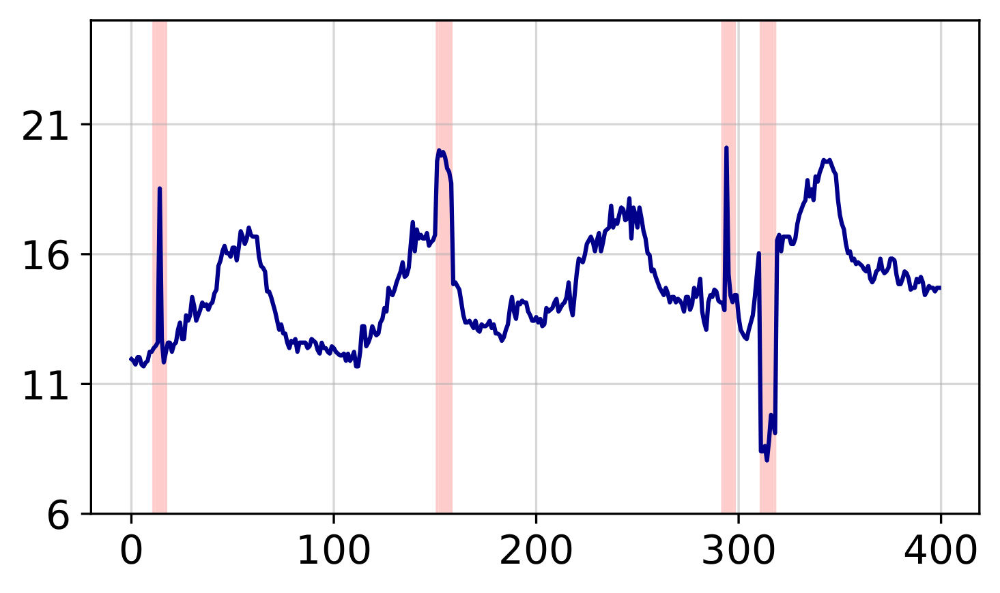

# TSRBench

**EVT-based noise injection toolkit for evaluating time series robustness**


[](https://pypi.org/project/tsrbench/)
[](https://pypi.org/project/tsrbench/)

TSRBench injects realistic corruptions into **any** time series data. Point your CSV at it and get corrupted versions out -- no special formatting, no domain restrictions. It works on sensor readings, stock prices, weather logs, energy consumption, medical signals, or any tabular time series.

The core idea: corruption amplitudes are calibrated using **Extreme Value Theory (EVT)** via the SPOT algorithm, so injected noise respects the statistical extremes of each individual series rather than using arbitrary fixed magnitudes.

<p align="center">
  
  
  
  
</p>
<p align="center">
  <em>Original | Level Shift | Exponential Spike | Combined</em>
</p>

---

## Installation

```bash
pip install tsrbench
```

Or from source:

```bash
git clone https://github.com/dongbeank/TSRBench.git
cd TSRBench
pip install -e .
```

---

## Quick Start — Python API

The `corrupt()` method is the easiest way to use TSRBench. It accepts a **1D array**, **2D array**, or **pandas DataFrame**, handles standardization internally, and returns corrupted versions in the same format.

### Corrupt a 1D signal

```python
from tsrbench import CollectiveNoise
import numpy as np

signal = np.random.randn(10000)

cn = CollectiveNoise(seed=2025)
results = cn.corrupt(signal, noise_level=3)

# results is a dict with 6 keys:
# results['shift']     — level shift corruption
# results['spike']     — exponential spike corruption
# results['impulse']   — single-point impulse corruption
# results['gaussian']  — additive Gaussian noise
# results['missing']   — zero-valued dropout
# results['combined']  — union of shift + spike + impulse
```

### Corrupt a DataFrame (multi-column)

```python
import pandas as pd

df = pd.read_csv("my_data.csv")  # first col = date, rest = numeric
cn = CollectiveNoise(seed=2025)
results = cn.corrupt(df, noise_level=3, skip_first_col=True)

# Each result is a DataFrame with the same columns as input.
# The date column is preserved unchanged.
results['shift'].to_csv("my_data_shift.csv", index=False)
```

### Corrupt a 2D numpy array

```python
X = np.random.randn(5000, 7)  # 5000 time steps, 7 channels
cn = CollectiveNoise(seed=2025)
results = cn.corrupt(X, noise_level=3, skip_first_col=False)

# results['combined'] is a (5000, 7) array
```

### Non-negative data (e.g., electricity)

```python
cn = CollectiveNoise(seed=2025)
results = cn.corrupt(X, noise_level=3, zero_clip=True)  # clips negatives to 0
```

> See [`examples/quickstart.ipynb`](examples/quickstart.ipynb) for a full interactive walkthrough with visualizations.

---

## Quick Start — CLI

For batch processing all 5 severity levels and 6 noise types at once:

```bash
python -m tsrbench \
    --data-path my_data.csv \
    --root-path ./data/ \
    --output-path ./data/noisy/
```

Your CSV just needs: first column = timestamps/index, remaining columns = numeric values. That's it.

This produces **30 files** (5 levels x 6 types):
```
my_data_level_1_type_shift.csv
my_data_level_1_type_spike.csv
my_data_level_1_type_impulse.csv
my_data_level_1_type_gaussian.csv
my_data_level_1_type_missing.csv
my_data_level_1_type_combined.csv
...
my_data_level_5_type_combined.csv
```

### Reproduce paper benchmarks

```bash
bash scripts/generate_benchmark.sh
```

Generates corrupted data for ETTm1, ETTm2, ETTh1, ETTh2, Electricity, Weather.

---

## Corruption Types

TSRBench provides **6 corruption types**, each saved as a separate CSV:

| Type | Description | Positions |
|:-----|:------------|:----------|
| **Level Shift** | Sustained deviation over multiple time steps | Independent (Poisson + Geometric) |
| **Exponential Spike** | Transient peak with exponential rise/fall shape | Independent, non-overlapping with Shift |
| **Impulse** | Single-point spike (one time step) | Independent, non-overlapping with Shift & Spike |
| **Gaussian** | Additive N(0, σ) noise on every time step | All positions |
| **Missing** | Values set to zero (simulates sensor dropout) | Independent, non-overlapping with Shift, Spike & Impulse |
| **Combined** | Union of Shift + Spike + Impulse | Non-overlapping union |

Within a severity level, **anomaly positions are guaranteed non-overlapping** across Shift, Spike, Impulse, and Missing. Across severity levels, the same seed produces comparable positions for fair evaluation.

---

## How It Works

### Pipeline Overview

```
Original CSV (any time series)
    │
    ▼
StandardScaler (fit + transform per column)
    │
    ▼
For each column:
    ├── SPOT algorithm → EVT thresholds (upper/lower bounds)
    ├── Poisson process → anomaly occurrence times
    ├── Geometric distribution → anomaly durations
    │
    ├── Level Shift (sustained deviation, first priority)
    ├── Exp Spike (transient peak, avoids Shift)
    ├── Impulse (single-point, avoids Shift & Spike)
    ├── Missing (zero-valued, avoids Shift, Spike & Impulse)
    ├── Gaussian (additive noise on all time steps)
    └── Combined (Shift + Spike + Impulse union)
    │
    ▼
StandardScaler (inverse_transform)
    │
    ▼
Corrupted output (same format as input)
```

### EVT Amplitude Calibration (SPOT)

The SPOT (Streaming Peaks-over-Threshold) algorithm analyzes the tail distribution of each column to find realistic anomaly thresholds. Given a risk parameter `q` (the `amp` parameter), SPOT finds threshold values that would be exceeded with probability `q`.

- **Unidirectional** (SPOT, dSPOT): upper thresholds only
- **Bidirectional** (biSPOT, bidSPOT): both upper and lower thresholds, enabling positive and negative corruptions

Thresholds are computed **per-column** and **cached across severity levels**.

### Anomaly Occurrence (Poisson Process)

```
N ~ Poisson(freq × T),    T = 2L - 1
```

A steady-state filter keeps approximately half of the generated points, uniformly distributed across the series.

### Anomaly Duration (Geometric Distribution)

- **Level Shift**: `d ~ Geometric(1/(dur-1)) + 1`
- **Exponential Spike**: ascending `d1` and descending `d2`, each `~ Geometric(2/dur)`
- **Impulse**: duration is always 1 (single time step)
- **Missing**: same distribution as Level Shift (`d ~ Geometric(1/(dur-1)) + 1`)

### Noise Shapes

**Level Shift** — sustained flat deviation:
```
─────┌──────────┐─────
     │          │
     └──────────┘
     ←── d ────→
```

**Exponential Spike** — transient peak with exponential rise/fall:
```
         ╱╲
        ╱  ╲
       ╱    ╲
      ╱      ╲
─────╱        ╲─────
     ← d1 →← d2 →
```

**Impulse** — single-point spike:
```
         │
         │
─────────┼──────────
```

**Gaussian** — additive noise on every time step:
```
~~~~~~~~~~~~~~~~~~~
```

**Missing** — values drop to zero at independent positions:
```
─────┌──────────┐─────
     │  → 0.0   │
     └──────────┘
```

### Bidirectional Noise

For bidirectional SPOT variants (biSPOT, bidSPOT), each anomaly is randomly assigned as positive or negative with equal probability.

### Non-Overlapping Guarantee

Within a single severity level, anomaly positions are assigned with priority: **Shift → Spike → Impulse → Missing**. Each subsequent type avoids positions already occupied by higher-priority types. Gaussian noise is independent (applied everywhere).

---

## Noise Parameters

### Level Shift / Exponential Spike / Impulse

| Level | `freq` | `dur` | `amp` (SPOT q) | Description |
|:-----:|:------:|:-----:|:---------------:|:------------|
| 1 | 0.002 | 6 | 0.0016 | Minimal — rare, short, conservative |
| 2 | 0.004 | 9 | 0.0016 | Mild — more frequent, slightly longer |
| 3 | 0.004 | 12 | 0.0004 | Moderate — longer, more extreme |
| 4 | 0.008 | 12 | 0.0004 | Strong — frequent, long, extreme |
| 5 | 0.008 | 15 | 0.0001 | Severe — most frequent, longest, most extreme |

> **Note**: Lower `amp` = lower exceedance probability = more extreme EVT threshold = larger noise.

Impulse uses the same `freq` and `amp` as Exponential Spike (duration is always 1).

### Gaussian

| Level | `sigma` | Description |
|:-----:|:-------:|:------------|
| 1 | 0.1 | Light background noise |
| 2 | 0.2 | Moderate noise |
| 3 | 0.3 | Noticeable noise |
| 4 | 0.5 | Heavy noise |
| 5 | 0.8 | Severe noise |

**Sigma is applied in standardized space** — after `StandardScaler`, each column has mean=0 and std=1. So `sigma=0.3` means Gaussian noise with standard deviation equal to 30% of the original data's standard deviation. This makes the noise scale proportional to each column's variability, regardless of the original units.

A minimum sigma floor (default `0.01`, configurable via `min_sigma`) prevents zero noise on constant or near-constant columns.

### Missing

Missing uses the same `freq` and `dur` parameters as Level Shift to determine dropout segment positions and durations, but generates its own independent random positions (not the same positions as Level Shift).

---

## Custom Dataset Guide

### CSV Format

Your CSV just needs:
- **First column**: Timestamps or index (any type, not used for injection)
- **Remaining columns**: Numeric time series values

```csv
date,temperature,humidity,pressure
2020-01-01 00:00,21.3,65.2,1013.2
2020-01-01 01:00,20.8,66.1,1013.5
...
```

### One-Command Generation

```bash
python -m tsrbench \
    --data-path my_data.csv \
    --root-path ./my_dataset/ \
    --output-path ./my_dataset/noisy/
```

### SPOT Parameter Tuning

| Parameter | Default | When to Adjust |
|:----------|:-------:|:---------------|
| `--spot-type` | `bidspot` | Use `bispot` for short series (<1000 pts); `dspot`/`bidspot` for non-stationary data |
| `--spot-n-points` | `8` | Increase (10-20) for noisy data; decrease (4-6) for clean data |
| `--spot-depth` | `0.01` | Increase (0.02-0.05) for highly non-stationary series |
| `--spot-init-points` | `0.05` | Increase if SPOT fails to converge |
| `--spot-init-level` | `0.98` | Lower (0.95) for more conservative thresholds |
| `--zero-clip` | `False` | Set `True` for non-negative data (e.g., electricity consumption) |

### Custom Noise Parameters

```python
from tsrbench import CollectiveNoise

custom_shift = {
    1: {'freq': 0.001, 'dur': 4, 'amp': 0.002},
    2: {'freq': 0.003, 'dur': 8, 'amp': 0.001},
    3: {'freq': 0.005, 'dur': 12, 'amp': 0.0005},
}
custom_spike = {
    1: {'freq': 0.001, 'dur': 4, 'amp': 0.002},
    2: {'freq': 0.003, 'dur': 8, 'amp': 0.001},
    3: {'freq': 0.005, 'dur': 12, 'amp': 0.0005},
}
custom_gaussian = {
    1: {'sigma': 0.05},
    2: {'sigma': 0.15},
    3: {'sigma': 0.3},
}

cn = CollectiveNoise(
    seed=2025,
    level_shift_args=custom_shift,
    exp_spike_args=custom_spike,
    gaussian_args=custom_gaussian,
    min_sigma=0.01,
)
```

---

## Visualization

```python
from tsrbench import plot_corruption_comparison, plot_severity_levels, plot_noise_only

# Side-by-side: Original | Shift | Spike | Combined
plot_corruption_comparison(
    "data/my_data.csv", "data/noisy/",
    column="temperature", level=3,
    save_path="figures/comparison.png"
)

# All 5 severity levels for one noise type
plot_severity_levels(
    "data/my_data.csv", "data/noisy/",
    column="temperature", noise_type="combined",
    save_path="figures/severity.png"
)

# Isolated noise signal (corrupted - original)
plot_noise_only(
    "data/my_data.csv", "data/noisy/",
    column="temperature", level=3,
    save_path="figures/noise_only.png"
)
```

---

## API Reference

### `CollectiveNoise`

```python
CollectiveNoise(
    seed=2025,
    level_shift_args=None,   # Dict {level: {freq, dur, amp}}
    exp_spike_args=None,     # Dict {level: {freq, dur, amp}}
    gaussian_args=None,      # Dict {level: {sigma}}
    spot_args=None,          # Dict {type, n_points, depth, init_points, init_level}
    min_sigma=0.01,          # Minimum sigma floor for Gaussian noise
)
```

#### Methods

| Method | Description |
|:-------|:------------|
| `corrupt(data, noise_level, skip_first_col, zero_clip)` | **High-level API.** Corrupt a DataFrame, 2D array, or 1D array directly. Returns dict of corrupted outputs. |
| `inject_level_shift(X, noise_level, exclude_mask=None)` | Inject level shift into 1D standardized signal. Returns noise array. |
| `inject_exp_spike(X, noise_level, exclude_mask=None)` | Inject exponential spike. Returns noise array. |
| `inject_impulse(X, noise_level, exclude_mask=None)` | Inject single-point impulse spikes. Returns noise array. |
| `inject_gaussian(X, noise_level)` | Inject Gaussian noise on all time steps. Returns noise array. |
| `inject_missing(X, noise_level, exclude_mask=None)` | Generate boolean missing-value mask. Returns bool array. |
| `inject_all_noise(X, noise_level)` | All types at once with non-overlapping positions. Returns dict. |
| `inject_noise(X, noise_level)` | Legacy: returns `(shift_noise, spike_noise)` tuple. |
| `make_noise_datasets(args)` | Generate all corrupted CSVs (6 types x 5 levels) from a dataset. |
| `custom_inject_level_shift(X, freq, dur, amp, exclude_mask=None)` | Level shift with custom parameters. |
| `custom_inject_exp_spike(X, freq, dur, amp, exclude_mask=None)` | Exponential spike with custom parameters. |
| `custom_inject_impulse(X, freq, amp, exclude_mask=None)` | Impulse with custom parameters. |

---

## SPOT Algorithm Variants

| Variant | Handles Non-Stationarity | Bidirectional | Best For |
|:--------|:------------------------|:--------------|:---------|
| SPOT | No | No | Stationary, one-sided data |
| biSPOT | No | Yes | Stationary, symmetric data |
| dSPOT | Yes | No | Non-stationary, one-sided data |
| bidSPOT | Yes | Yes | Non-stationary, symmetric data **(default)** |

---

## Data Validation

For large datasets, some columns may produce extreme corruptions. TSRBench includes a validation module:

```python
from tsrbench.validate import DataValidationAndRegeneration

validator = DataValidationAndRegeneration(seed=2025)
problems = validator.check_problematic_columns(
    'electricity', './dataset/electricity/', level=3, threshold_multiplier=3
)
if problems:
    validator.extract_problematic_columns('electricity', './dataset/electricity/', problems)
    validator.regenerate_noise_data('electricity2.csv', './dataset/electricity/')
```

---

## Citation

If you find this repo useful for your research, please cite our paper:

```bibtex
@inproceedings{
kim2026local,
title={Local Geometry Attention for Time Series Forecasting under Realistic Corruptions},
author={Dongbin Kim and Youngjoo Park and Woojin Jeong and Jaewook Lee},
booktitle={The Fourteenth International Conference on Learning Representations},
year={2026},
url={https://openreview.net/forum?id=NCQPCxN7ds}
}
```

---

## License

MIT License. See [LICENSE](LICENSE) for details.
